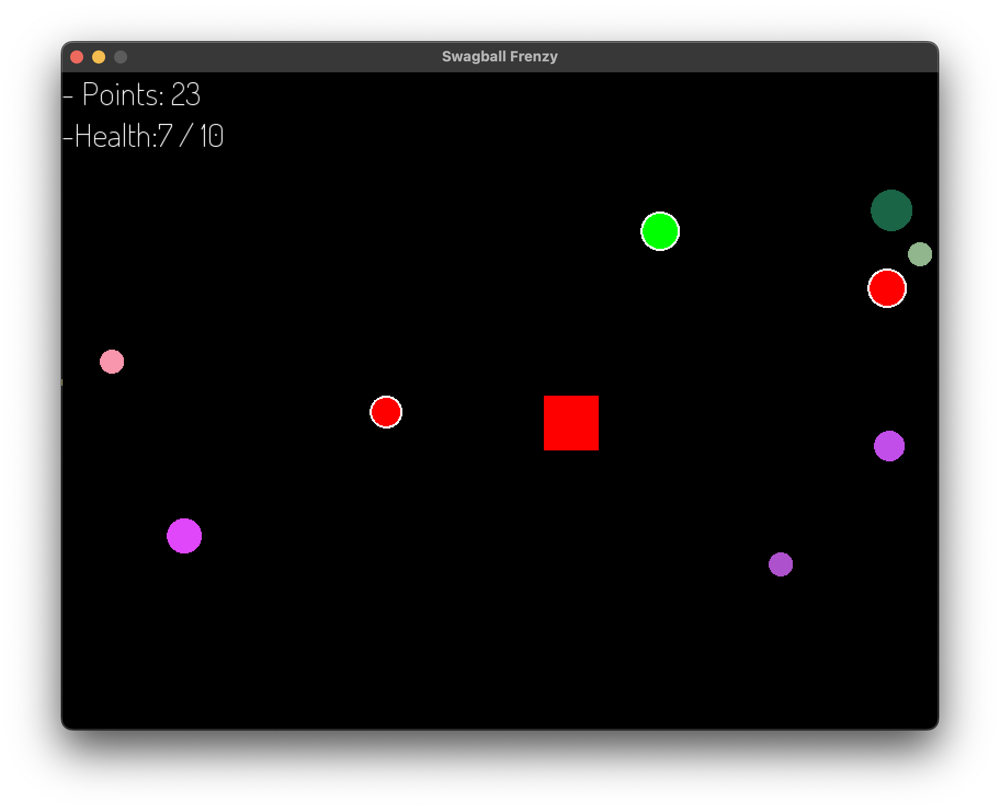
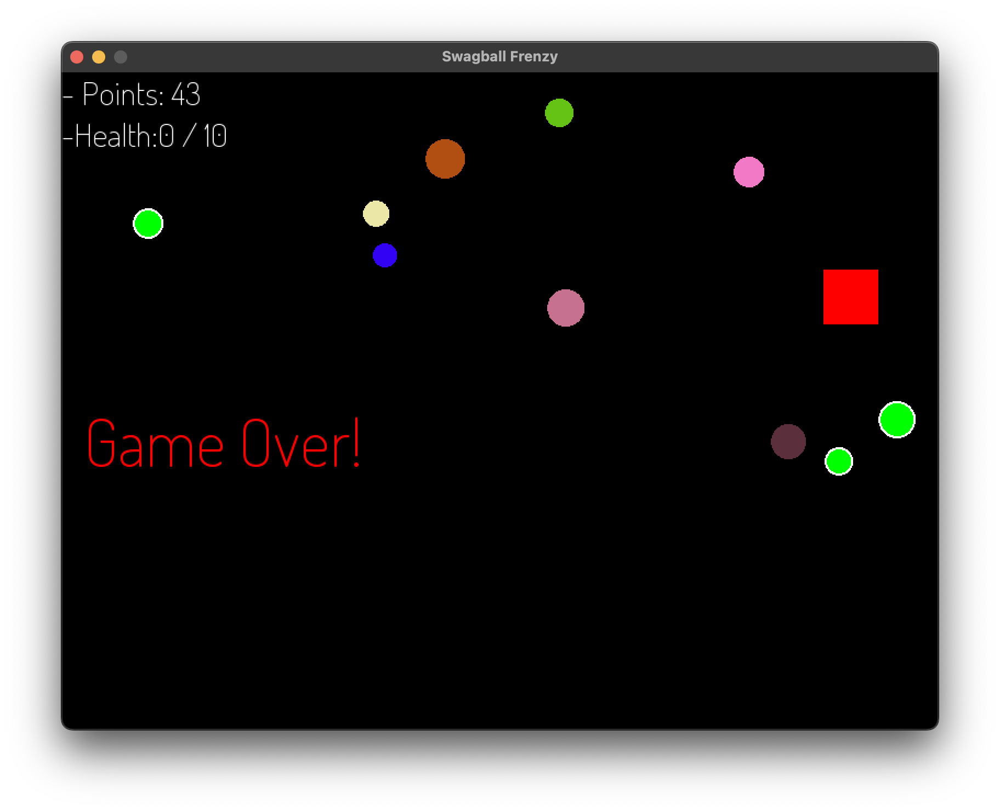

# OOP Project - Swagball Frenzy Game

This is a simple 2D game built for practicing object-oriented programming (OOP) principles. The game is developed in C++ using the SFML (Simple and Fast Multimedia Library).

The game features randomly spawning swag balls of various types that the player collects to earn points, heal, or avoid damage. The objective is to survive as long as possible, with the game ending when the player's health is depleted.

## Features

- **Player Movement**: Control the player using keyboard inputs (W, A, S, D).
- **Swag Balls**: Randomly spawning objects with different effects:
  - Default: Increases points.
  - Damaging: Reduces player health.
  - Healing: Restores player health.
- **Collision Detection**: Detects interactions between the player and swag balls.
- **GUI**: Displays the player's points and health.
- **Game Over**: Ends the game when the player's health reaches zero.

## Project Structure

- **`src/`**: Contains the source code for the game.
- **`resources/fonts/`**: Includes font files used in the game.
- **`.vscode/`**: Configuration files for Visual Studio Code.
- **`bin/`**: Output directory for the compiled binary.

Files in the `src/` directory:
- **`Game.cpp`**: Main game loop and initialization.
- **`Player.cpp`**: Player class implementation.
- **`SwagBall.cpp`**: Swag ball class implementation.
- **`main.cpp`**: Entry point of the game.
